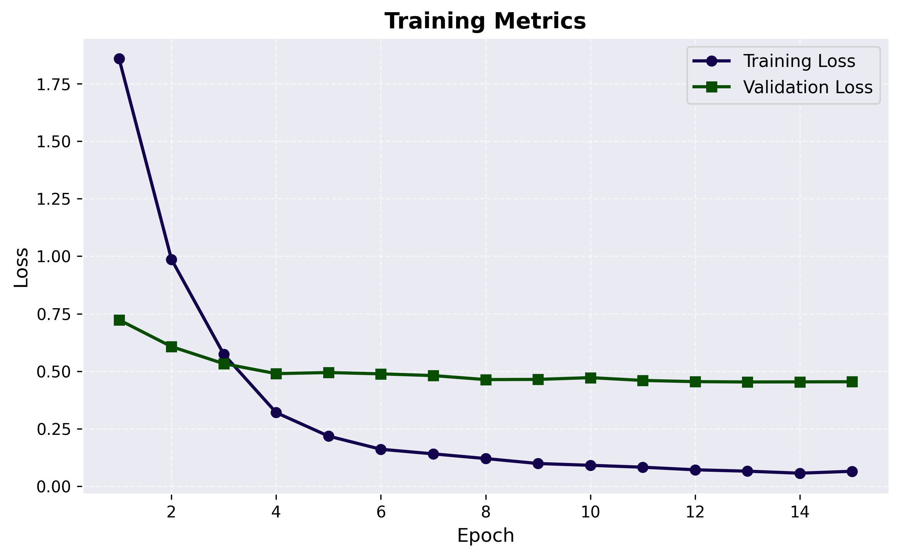

# Meter Vision - Energy Meter Reading with Florence 2

This project fine-tunes the Microsoft Florence-2 vision-language model to read energy meter values from images.

## Setup

```bash
# Clone the repository
git clone https://github.com/ahmedsalim3/meter-vision.git
cd meter-vision

# Install the package
pip install -e .
```

## Usage

### Training

```bash
python scripts/train.py
# Default parms are in config.py
```

### Inference

```bash
python scripts/inference.py images/test-image-3.jpg
```

## Model



